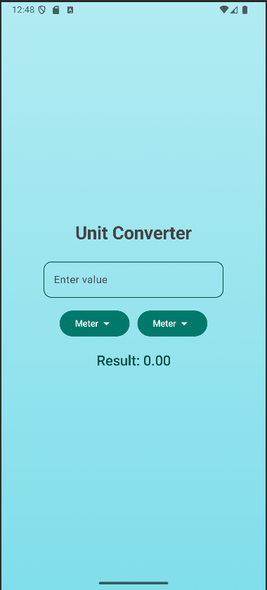

# Unit Converter App

## Overview
The **Unit Converter** app is a simple yet powerful tool built with Jetpack Compose that allows users to convert values between different units seamlessly. With an intuitive UI and real-time conversion updates, this app provides a smooth user experience.

## Features
- Convert between multiple units dynamically.
- Real-time conversion as you type.
- User-friendly interface with Material Design components.
- Dropdown selection for input and output units.
- Beautiful gradient background for a modern look.

## Technologies Used
- **Kotlin**
- **Jetpack Compose**
- **Material3 UI Components**

## Installation
1. Clone the repository:
   ```bash
   git clone https://github.com/your-username/unit-converter.git
   ```
2. Open the project in **Android Studio**.
3. Sync dependencies and run the app on an emulator or a physical device.

## Usage
1. Enter the value to be converted in the input field.
2. Select the input unit from the dropdown.
3. Select the desired output unit from the dropdown.
4. The converted value is displayed instantly.

## Screenshot


##AUTHOR-Kush
